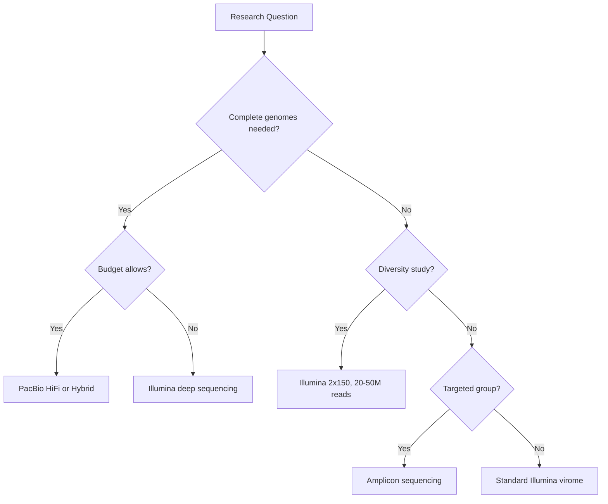

# Sequencing Strategies for Virome Analysis

> **Last Updated:** November 29, 2025

Choosing the right sequencing strategy is crucial for successful virome analysis. This guide covers sequencing platforms, library preparation methods, coverage requirements, and how to match your strategy to your research question.

## Sequencing Platform Overview

### Platform Comparison

| Platform | Read Length | Accuracy | Throughput | Cost/Gb | Best For |
|----------|-------------|----------|------------|---------|----------|
| **Illumina** | 150-300 bp | >99.9% | Very High | $ | Diversity studies, quantification |
| **PacBio HiFi** | 10-25 kb | >99.9% | High | $$$ | Complete genomes, structural variation |
| **Oxford Nanopore** | 1-100+ kb | ~95-99% | Medium-High | $$ | Long-range assembly, real-time analysis |
| **MGI/BGI** | 150-300 bp | >99% | Very High | $ | Similar to Illumina, lower cost |

### Illumina Sequencing

**Platforms:** NovaSeq, NextSeq, MiSeq, HiSeq

**Advantages:**
- Highest accuracy (>Q30)
- Well-established protocols
- Extensive computational tools
- Cost-effective for high throughput
- Excellent for paired-end reads

**Limitations:**
- Short read length challenges assembly
- Can miss structural variants
- Repetitive regions difficult to resolve
- GC bias in some library prep methods

**When to use:**
- Viral diversity and abundance studies
- Comparative viromics (multiple samples)
- Targeted amplicon sequencing
- When high accuracy is paramount
- Budget-constrained projects

**Recommended configurations:**
- **Diversity studies**: 2×150 bp, 10-20M reads per sample
- **Deep virome**: 2×250 bp, 50-100M reads per sample
- **Metagenome with virome**: 2×150 bp, 100-300M reads per sample

### PacBio HiFi Sequencing

**Platform:** Sequel II/IIe, Revio

**Advantages:**
- Long, accurate reads (HiFi)
- Complete viral genomes in single reads
- Resolves repeat regions
- No GC bias
- Detects structural variants

**Limitations:**
- More expensive per gigabase
- Lower throughput than Illumina
- Requires more input DNA (typically)
- Computational intensity for assembly

**When to use:**
- Isolate sequencing (complete genomes)
- Characterizing structural variation
- Resolving complex repeats
- Host-integrated prophages with flanking regions
- Novel virus discovery requiring complete genomes

**Recommended configurations:**
- **Single viral isolate**: 1-5 SMRT cells (Gb scale)
- **Complex virome**: 5-10 SMRT cells for deep coverage
- **Hybrid approach**: Combine with Illumina for accuracy + completeness

### Oxford Nanopore Sequencing

**Platforms:** MinION, GridION, PromethION

**Advantages:**
- Very long reads (10-100+ kb)
- Real-time sequencing and analysis
- Portable (MinION)
- Direct RNA sequencing possible
- Rapid turnaround
- Lower capital cost

**Limitations:**
- Lower accuracy than Illumina/HiFi (~95-99%)
- Homopolymer errors
- Requires more input DNA
- Computational tools still maturing

**When to use:**
- Rapid outbreak investigation
- Field deployment
- Long-range structural analysis
- Direct RNA virus sequencing
- When real-time results needed

**Recommended configurations:**
- **MinION**: Quick virome screen, 1-2 flow cells
- **PromethION**: Deep virome, production-scale
- **Adaptive sampling**: Target specific viral sequences in real-time

## Library Preparation Strategies

### Standard Shotgun Metagenomics

**Principle:** Fragment all DNA, add adapters, sequence everything.

**Protocol:**
```bash
1. Fragment DNA (enzymatic or mechanical)
2. End-repair and A-tailing
3. Adapter ligation
4. Size selection (optional)
5. PCR amplification (minimal cycles)
6. Quantification and QC
7. Sequencing
```

**Advantages:**
- Unbiased representation of viral genomes
- Quantitative (read abundance reflects genome abundance)
- Works for diverse viral types
- Standard, well-supported protocols

**Limitations:**
- Requires sufficient input DNA (typically 1-100 ng)
- Host contamination in unenriched samples
- Rare viruses may need high sequencing depth

**When to use:**
- Standard virome analysis
- Diversity and abundance studies
- Sufficient input material available

### Amplicon Sequencing

**Principle:** PCR amplify specific viral genes, then sequence amplicons.

**Common targets:**
- **DNA viruses**: DNA polymerase genes, capsid genes
- **RNA viruses**: RdRp (RNA-dependent RNA polymerase)
- **Specific groups**: Papillomavirus L1, adenovirus hexon, etc.

**Advantages:**
- Extremely sensitive (can detect rare viruses)
- Lower sequencing cost per sample
- Works with low-input samples
- Targeted for specific viral groups

**Limitations:**
- PCR bias
- Only detects amplified regions
- Primer design challenges (viral diversity)
- Not quantitative (PCR amplification bias)
- Misses unamplified viruses

**When to use:**
- Surveillance for specific viral families
- Low-biomass samples
- Cost-effective screening of many samples
- Phylogenetic studies of specific genes

### RNA Sequencing

**Specific considerations for RNA viruses:**

**Library prep options:**
1. **Random priming**: Captures all RNA sequences
2. **rRNA depletion**: Remove ribosomal contamination
3. **PolyA selection**: Only for polyA+ viral RNAs (rare in viruses)
4. **dsRNA enrichment**: Targets viral replication intermediates

**Challenges:**
- RNA degradation (use RNase-free everything)
- rRNA contamination (often >90% of reads)
- Variable strand specificity needs

**Stranded vs. Non-stranded:**
- **Non-stranded**: Cheaper, more standard
- **Stranded**: Preserves orientation, critical for some RNA viruses

**Recommended approach for RNA viromes:**
```bash
1. Extract RNA (DNase-treated to remove DNA)
2. Optional: dsRNA enrichment
3. rRNA depletion (CRITICAL for host-associated samples)
4. Stranded library prep
5. Sequencing (2×150 bp typical)
```

### Low-Input Library Preparation

**For samples <1 ng DNA:**

**Options:**
1. **Nextera XT**: Tagmentation-based, works with 1 ng
2. **SMARTer**: Template switching, works with <1 ng
3. **TruSeq Nano**: Standard Illumina, requires 25-200 ng (not low-input)
4. **MDA then standard library**: Amplify first, then make library

**Considerations:**
- More PCR cycles = more bias
- Adapter dimers more problematic
- Size selection often critical
- Negative controls absolutely essential

## Coverage and Sequencing Depth

### How Much Sequencing?

**Factors affecting depth requirements:**
- Research question (diversity vs. complete genomes)
- Sample complexity (simple vs. highly diverse)
- Viral abundance (high vs. low biomass)
- Assembly strategy (reference vs. de novo)

### Recommended Depths

#### Diversity/Community Analysis
**Goal:** Detect most abundant viruses, characterize community structure

**Illumina:**
- **Simple communities** (isolates, monocultures): 5-10M reads
- **Moderate complexity** (gut, marine): 20-50M reads
- **High complexity** (soil, sediment): 50-200M reads

**Expected:**
- Capture dominant viruses (>0.1% abundance)
- Miss rare viruses (<0.01%)
- Sufficient for diversity metrics
- Good for comparative studies

#### Deep Characterization
**Goal:** Complete/near-complete genomes of abundant viruses

**Illumina:**
- 50-100M reads for gut viromes
- 100-300M reads for environmental viromes
- More for highly diverse samples

**Expected:**
- Near-complete genomes for viruses >0.01% abundance
- Better assembly contiguity
- Detect rarer viruses
- Identify strain variation

#### Complete Genome Recovery
**Goal:** Closed, circularized viral genomes

**Long-read (PacBio/Nanopore):**
- 5-20 Gb for isolates
- 20-100 Gb for complex communities
- Depends on target genome sizes and abundance

**Expected:**
- Complete genomes for abundant viruses
- Resolve repeats and structural variations
- Phage-host linkages (if integrated)

### Rarefaction and Coverage

**Rarefaction curves** show whether you've sequenced deeply enough:

```python
# Conceptual rarefaction curve
from matplotlib import pyplot as plt

reads = [1M, 5M, 10M, 20M, 50M, 100M]
new_viruses = [100, 250, 350, 425, 475, 490]

plt.plot(reads, new_viruses)
plt.xlabel("Sequencing Depth (reads)")
plt.ylabel("Unique Viruses Detected")
```

**Interpretation:**
- **Steep curve**: Not saturated, more sequencing will find more viruses
- **Plateau**: Saturated, additional sequencing has diminishing returns
- **No plateau**: Extremely diverse, may never saturate (e.g., ocean viromes)

## Paired-End vs. Single-End

### Paired-End Sequencing

**Configuration:** 2×150 bp, 2×250 bp (read pairs from both ends of DNA fragment)

**Advantages:**
- Improved assembly (scaffolding information)
- Better repeat resolution
- Detects structural variants
- Higher confidence alignments
- Useful for strain differentiation

**Limitations:**
- More expensive than single-end
- Slightly lower total bases per run
- Requires paired-end aware tools

**When to use:**
- De novo assembly
- Comprehensive virome studies
- When budget allows
- **Recommended for most virome projects**

### Single-End Sequencing

**Configuration:** 1×150 bp, 1×75 bp

**Advantages:**
- Lower cost per sample
- More total bases per run
- Sufficient for some applications
- Faster library prep

**When to use:**
- Reference-based mapping only
- Simple viral communities
- Budget-constrained projects
- Amplicon sequencing

## Read Length Considerations

### Short Reads (50-150 bp)

**Pros:**
- Lower cost
- Higher throughput
- Established tools

**Cons:**
- Assembly challenges
- Poor repeat resolution
- Limited for complex genomes

**Use for:**
- Reference mapping
- Read-based classification (Kraken, Kaiju)
- Cost-effective screening

### Medium Reads (150-300 bp)

**Pros:**
- Balance of cost and assembly quality
- Good for most viruses
- Paired-end overlap possible

**Cons:**
- Still challenging for repeats
- Assembly not as contiguous as long reads

**Use for:**
- **Standard virome analysis (most common)**
- Good assembly with paired-end
- Versatile for many applications

### Long Reads (>10 kb)

**Pros:**
- Complete viral genomes
- Resolve structural complexity
- Less assembly ambiguity

**Cons:**
- Higher cost
- Lower throughput
- More input DNA needed

**Use for:**
- Novel virus characterization
- Structural variation studies
- Prophage architecture
- Host-phage linkages

## Hybrid Sequencing Approaches

### Illumina + PacBio/Nanopore

**Strategy:** Use long reads for assembly scaffolding, short reads for error correction.

**Workflow:**
```bash
1. Sequence with long reads (PacBio/Nanopore)
2. Assemble long reads into contigs
3. Sequence same sample with Illumina (high coverage)
4. Polish long-read assembly with Illumina reads
5. Result: Long contigs with high accuracy
```

**Advantages:**
- Best of both worlds: length + accuracy
- Cost-effective compromise
- Resolves complex structures accurately

**Limitations:**
- Two library preps required
- More computational analysis
- Higher overall cost

**When to use:**
- Important novel viruses needing complete genomes
- Prophage characterization
- Research projects with sufficient budget
- Structural variation studies

### Adaptive/Targeted Sequencing

**Nanopore-specific feature:** Real-time sequence analysis and selective sequencing.

**Applications:**
- Enrich for specific viral sequences during run
- Deplete abundant contaminants (host, bacteria)
- Focus sequencing on target viruses

**Example workflow:**
```bash
1. Start sequencing run
2. Real-time basecalling identifies sequences
3. Reject reads matching host/bacterial references
4. Continue sequencing viral reads only
5. Result: Enriched viral dataset
```

## Sample Multiplexing and Barcoding

### When to Multiplex?

**Advantages:**
- Reduce cost per sample
- Increase throughput
- Efficient use of sequencing capacity

**Considerations:**
- Need enough reads per sample after demultiplexing
- Barcode loss can occur (typically 1-5%)
- Multiplexing level depends on viral complexity

### Multiplexing Guidelines

| Sample Complexity | Platform | Reads Needed/Sample | Max Multiplexing |
|-------------------|----------|---------------------|------------------|
| Low (isolates) | Illumina MiSeq | 5-10M | 10-20 samples |
| Medium (gut) | Illumina NextSeq | 20-50M | 8-16 samples |
| High (soil, ocean) | Illumina NovaSeq | 50-200M | 20-40 samples |

**Example:**
- NovaSeq S4 flow cell: ~3-4 billion reads
- Target 50M reads per sample
- Can multiplex 60-80 samples
- Account for 10-20% loss to QC and host filtering

### Barcoding Strategies

**Dual indexing** (recommended):
- Reduces barcode hopping/cross-contamination
- Two barcodes per sample (i5 and i7 adapters)
- Critical for high-plex runs

**Unique molecular identifiers (UMIs):**
- Tag individual molecules before amplification
- Remove PCR duplicates computationally
- Important for low-input samples with many PCR cycles
- Enables accurate quantification

## Cost Considerations

### Per-Sample Cost Estimates (2025)

| Strategy | Platform | Cost/Sample | Notes |
|----------|----------|-------------|-------|
| Basic virome | Illumina (10M reads) | $50-150 | Multiplexed, 2×150 bp |
| Standard virome | Illumina (50M reads) | $150-300 | Good for most studies |
| Deep virome | Illumina (200M reads) | $300-600 | High diversity samples |
| Complete genomes | PacBio HiFi | $500-2000 | Isolates or low complexity |
| Rapid outbreak | Nanopore MinION | $100-500 | Lower depth, fast results |

**Cost-saving strategies:**
- Multiplex aggressively for simple samples
- Use amplicon sequencing for screening
- Reserve deep sequencing for high-priority samples
- Pilot with small-scale sequencing first
- Use appropriate depth (don't over-sequence)

## Special Considerations

### Metagenome vs. Virome Sequencing

**Metagenome (total community DNA):**
- **Pros**: Captures prophages, maintains host context
- **Cons**: Mostly non-viral reads (>90% bacteria/eukarya in unenriched)
- **When**: Studying prophages, have high sequencing budget

**Enriched virome (VLP-prepared):**
- **Pros**: Enriched viral signal, more cost-effective
- **Cons**: Misses prophages, sample prep complexity
- **When**: Standard virome studies, focus on free viruses

### Quantitative vs. Qualitative

**For quantitative analysis** (accurate viral abundances):
- Avoid or minimize amplification (MDA/PCR biases)
- Use spike-ins for normalization
- Deep, even coverage
- Careful library prep (minimal PCR cycles)

**For qualitative analysis** (presence/absence, diversity):
- Amplification acceptable
- Lower depth may suffice
- Focus on maximizing virus recovery

### Time-Series and Longitudinal Studies

**Considerations:**
- Consistent sample prep across timepoints
- Batch effects (sequence all together if possible)
- Sufficient depth to detect changes (50M+ reads)
- Technical replicates for key timepoints
- Spike-in controls for cross-timepoint comparison

## Decision Tree: Choosing Your Strategy



## Recommended Strategies by Study Type

### Study Type 1: Exploratory Virome Diversity
**Goal:** Characterize viral community, compare between samples

**Recommended:**
- Platform: Illumina
- Configuration: 2×150 bp paired-end
- Depth: 20-50M reads per sample
- Multiplexing: 10-20 samples per run (NextSeq)
- Library: Standard shotgun metagenomics
- Sample prep: VLP enrichment + DNase

### Study Type 2: Novel Virus Discovery
**Goal:** Complete genomes of unknown viruses

**Recommended:**
- Platform: PacBio HiFi or Hybrid (PacBio + Illumina)
- Configuration: PacBio 15-20kb HiFi, Illumina 2×250bp
- Depth: 20-50 Gb PacBio, 100M reads Illumina
- Library: Shotgun for both platforms
- Sample prep: Enriched virome or isolate culture

### Study Type 3: Outbreak Investigation
**Goal:** Rapid identification of pathogenic viruses

**Recommended:**
- Platform: Nanopore MinION or Illumina MiSeq
- Configuration: Nanopore long reads or 2×150 bp
- Depth: 5-20M reads
- Turnaround: <24 hours possible with Nanopore
- Library: Rapid library prep kits
- Analysis: Real-time for Nanopore

### Study Type 4: Large-Scale Epidemiology
**Goal:** Screen hundreds of samples for specific viruses

**Recommended:**
- Platform: Illumina NovaSeq
- Configuration: 2×150 bp or amplicon approach
- Depth: 5-10M reads per sample (or less for amplicons)
- Multiplexing: 100+ samples per run
- Library: Amplicon (if targeting specific viruses) or shotgun
- Sample prep: Minimal processing for cost efficiency

## Next Steps

- **[Complete Tutorials](../tutorials/basic-metagenome-virome.md)** - Follow step-by-step sequencing workflows
- **[Tool Selection Guide](../tools/selection-guide.md)** - Choose analysis tools
- **[Best Practices](../best-practices/index.md)** - Ensure high-quality results

## Further Reading

- Warwick-Dugdale, J., et al. (2019). "Long-read viral metagenomics captures abundant and microdiverse viral populations." *PeerJ*, 7, e6800.
- Roux, S., et al. (2016). "Towards quantitative viromics for both double-stranded and single-stranded DNA viruses." *PeerJ*, 4, e2777.
- Garalde, D. R., et al. (2018). "Highly parallel direct RNA sequencing on an array of nanopores." *Nature Methods*, 15(3), 201-206.
