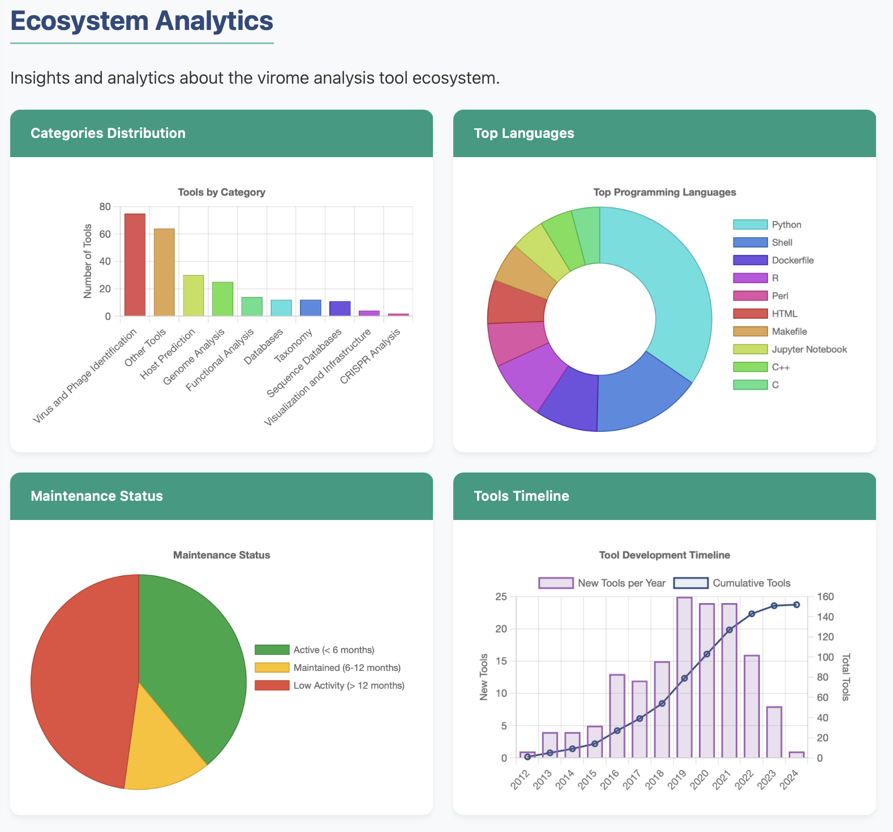

# Welcome to Awesome-Virome

A curated list of software, tools, and databases useful for virome analysis, including phages, viruses, and their interactions with hosts.

{ align=center width=250px }

## What is Awesome-Virome?

Awesome-Virome is a comprehensive collection of resources for studying viral communities in various environments. Whether you're a bioinformatician, a microbiologist, or a researcher in a related field, this repository aims to help you navigate the diverse landscape of tools available for virome analysis.

## Key Features

Awesome-Virome offers several unique features that enhance its value as a resource for the viral bioinformatics community:

- **Interactive Visualizations**: Dynamic network graph showing tool relationships and connections
- **Citation Analytics**: Growth trends and impact metrics for virome analysis tools
- **Enhanced Metadata**: Automated metadata enrichment from GitHub, GitLab, and Bitbucket
- **Community-Driven**: Standardized issue templates and workflows for contributions

## Get Started

- [Introduction](intro/index.md) - Learn about virome analysis and this repository
- [Tools Overview](tools/overview.md) - Explore the comprehensive list of tools
- [API Reference](api/overview.md) - Use the programmatic API
- [Contributing](contributing/guidelines.md) - Help improve the repository

## Popular Tools

Ranked by GitHub stars:

1. [AlphaFold-Multimer](https://github.com/deepmind/alphafold) - ⭐ 13320+ stars
2. [CovidMD](https://github.com/lammps/lammps) - ⭐ 2365+ stars
3. [BLAST+DIAMOND](https://github.com/bbuchfink/diamond) - ⭐ 1114+ stars
4. [metaviralSPAdes](https://github.com/ablab/spades/tree/metaviral_publication) - ⭐ 797+ stars
5. [Prodigal/MetaProdigal](https://github.com/hyattpd/Prodigal) - ⭐ 471+ stars

## Visualizing the Data

We're working on an interactive dashboard to visualize the relationships between tools and their impacts on the field. This feature will be available in a future update.

