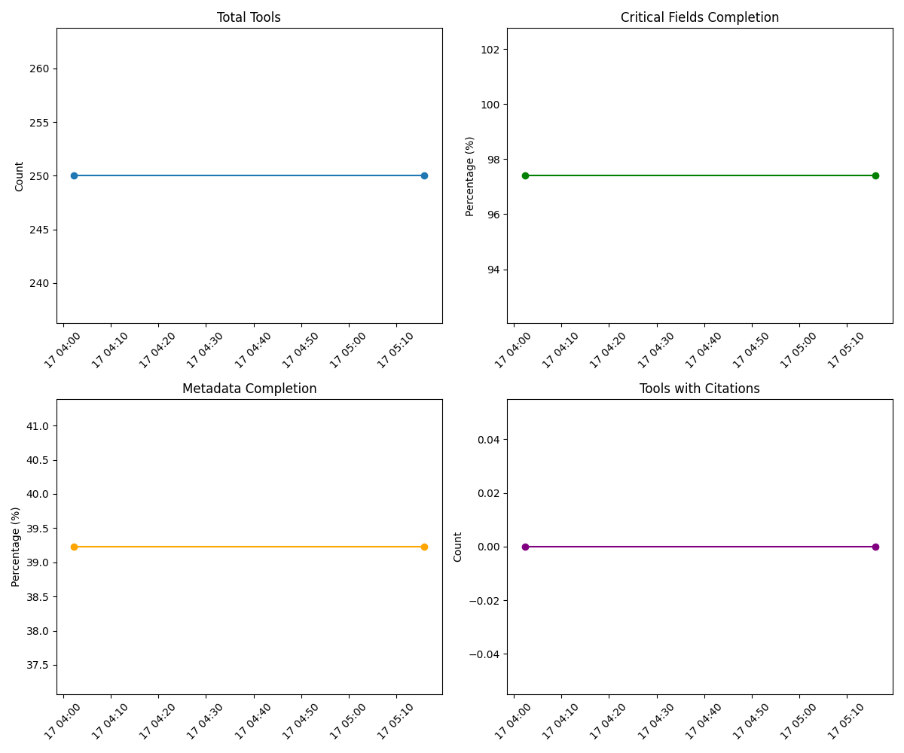

# Data Quality Metrics Report

Generated: 2025-03-17T05:15:53.974890

## Summary
- Total Tools: 250
- Tools with Metadata: 142 (56.8%)
- Tools with Citations: 0 (0.0%)
- Tools Updated in Last 30 Days: 0 (0.0%)
- Total GitHub Stars: 26143

## Data Completeness
- Critical Fields: 97.4%
- Important Fields: 77.7%
- Metadata Fields: 39.2%
- Bioinformatics Fields: 6.3%
- Academic Impact Fields: 0.7%

## Top Languages
- Python: 132
- Perl: 13
- R: 12
- C++: 9
- Java: 4

## Top Licenses
- GNU General Public License v3.0: 39
- MIT License: 38
- Other: 15
- Apache License 2.0: 8
- GNU General Public License v2.0: 3

## Changes Since Last Measurement
- Days Since Last Measurement: 0.1
- Tools Added: 0
- Critical Field Completion: 0.0% change
- Metadata Completion: 0.0% change
- Tools with Citations: 0 change

## Field Completion
### Most Complete Fields (>80%)
- stars: 115.2%
- name: 100.0%
- repository: 100.0%
- id: 100.0%
- description: 89.6%
- license: 87.2%

### Fields Needing Attention (<50%)
- is_archived: 0.0%
- last_commit: 0.0%
- contributors_count: 0.0%
- citation: 0.0%
- publication: 0.0%
- package_managers: 0.0%
- container_images: 0.0%
- installation_methods: 0.0%
- input_formats: 0.0%
- output_formats: 0.0%

## Data Quality Trends

