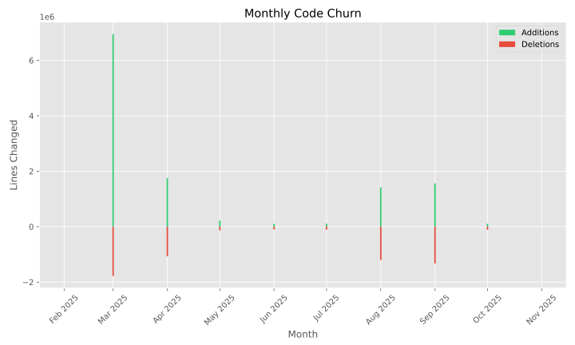
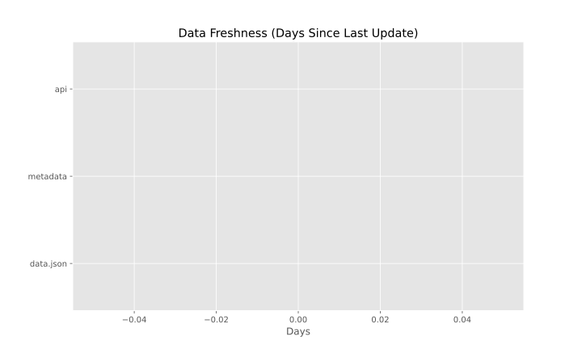

# Repository Health Report

*Report generated on $(date '+%Y-%m-%d')*

This report provides insights into the health and activity of the awesome-virome repository.

## Repository Summary

| Metric | Value |
| ------ | ----- |
| Total Commits | 892 |
| Total Contributors | 10 |
| Repository Age | 257 days |

## Data Freshness

| Dataset | Last Updated | Status |
| ------- | ------------ | ------ |
| data.json | 0 days ago | $([ 0 -lt 0 ] && echo "Missing" || ([ 0 -lt 7 ] && echo "✅ Fresh" || ([ 0 -lt 30 ] && echo "⚠️ Needs Update" || echo "❌ Outdated"))) |
| Metadata Files | 0 days ago | $([ 0 -lt 0 ] && echo "Missing" || ([ 0 -lt 7 ] && echo "✅ Fresh" || ([ 0 -lt 30 ] && echo "⚠️ Needs Update" || echo "❌ Outdated"))) |
| API Files | 0 days ago | $([ 0 -lt 0 ] && echo "Missing" || ([ 0 -lt 7 ] && echo "✅ Fresh" || ([ 0 -lt 30 ] && echo "⚠️ Needs Update" || echo "❌ Outdated"))) |

## Activity Charts

### Monthly Commit Activity

### Code Churn (Additions/Deletions)

## Contribution Analysis

### Top Contributors

### Contribution Distribution

## Data Freshness

## Health Recommendations

Based on the metrics in this report, here are some recommendations for maintaining repository health:

$([ 0 -gt 30 ] && echo "- **High Priority**: Update data.json which is now 0 days old" || echo "")
$([ 0 -gt 30 ] && echo "- **High Priority**: Update metadata files which are now 0 days old" || echo "")
$([ 0 -gt 30 ] && echo "- **High Priority**: Update API files which are now 0 days old" || echo "")

- Maintain regular updates to keep repository data fresh
- Encourage contributions from new maintainers to diversify repository maintenance
- Run data validation checks before major updates
- Review and update documentation to reflect current state of the project

## Historical Health Data

Historical health metrics are stored in the `metrics_history` directory and can be analyzed for trends over time.
